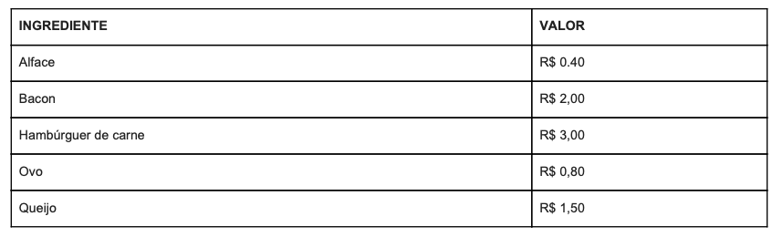

# Lanchonete-Challenge-Level-2
This project is a solution to a challenge. The main goal is to create a iOS app that simulates a hamburger purchasing app.

There are 4 screens:

* Main screen that has all of the sandwiches;

* After selecting a screen there's a confirmation screen;

* If the customer wants to personalize the sandwich, the customization screen is shown;

* The shopping cart screen shows the list of sandwiches added.

### Key points of the Challenge

The value of each menu option is given by the sum of the ingredients that make up the snack. In addition to these options, the customer can customize their snack and choose the ingredients they want. In this case, the price of the snack will also be calculated by adding the ingredients. 

**Ingredients**

**Sandwiches**

### Sketched solution

### Designs

# Demo

## Screenshots of the app

